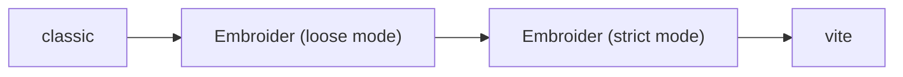
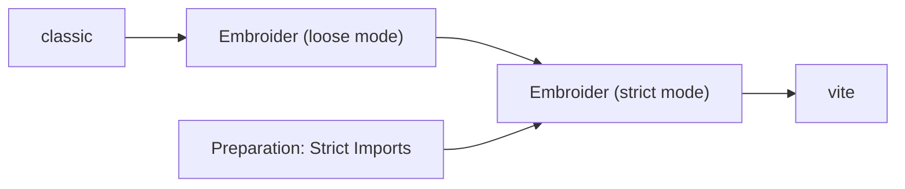

<!-- markdownlint-disable -->

# The Frontend City

Thomas Gossmann

<lucide-house /> <a href="https://gos.si" target="_blank">gos.si</a><br>
<simple-icons-bluesky /> <a href="https://bsky.app/profile/gos.si" target="_blank">gos.si</a><br/>
<simple-icons-github /> <a href="https://github.com/gossi" target="_blank">gossi</a><br>

---
class: text-center
---

# Brüssel


---
class: text-center
---

# Brüssel

<figure class="absolute left-1/2 bottom-12 top-26 -translate-x-1/2 flex flex-col items-center justify-center">
  
  <figcaption class="text-center w-full">540 Unispin in front of the Basilique Nationale du Sacré-Cœur</figcaption>
</figure>

---

# Problem Statement

- We explain a technical initiative to non-tech folks
- We use technical language in our explanation
- We are not understood
- They approve the budget for our technical initiative
- They won't - we weren't understood

## Examples

<v-click>

- (Local) Refactoring
- Writing RFCs
- <b>Change build system to Embroider/vite</b>
- ...

</v-click>

---
layout: two-cols-header
---

# Example: Change Build System to Embroider/vite

:: left ::

## Arguments

- It's faster
- It's fancy
- Tree shaking
- Smaller bundle size
- It's modern


:: right ::

<v-click>

## Questions

- What will it cost us?
- How long will it take?
- Half a year to have the same situation as we have now?
- How much features can be shipped instead?
- What's the return of this investment?

</v-click>


---
layout: quote
---

# Solution: Translate

> When we can explain it to my Mum, we are good.
> <br>
> <cite>- My Manager</cite>

---
layout: two-cols-header
---

::left::

## Task

Work on the Build System

::right::

<v-click>

## Responsibility

Keep the Frontend Operable

</v-click>

---
layout: center
---

# Question

What would you need to do to keep the Frontend Operable?


---
layout: center
---

# Question 2

What would you need to do to keep a _City Operable_?

---
layout: section
---

# The Frontend City

> We built this city\
> We built this city of rock and roll\
> Built this city\
> We built this city of rock and roll\
> <br>
> <cite>- [Starship](https://open.spotify.com/track/6OnfBiiSc9RGKiBKKtZXgQ)</cite>


---
layout: center
---

<div class="grid grid-auto-flow-col gap-5">
  <Card>
    <h2>Infrastructure</h2>
  </Card>

  <Card>
    <h2>Health & Security</h2>
  </Card>

  <Card>
    <h2>City Layout</h2>
  </Card>

  <Card>
    <h2>Sport & Entertainment</h2>
  </Card>

  <Card>
    <h2>Transportation</h2>
  </Card>
  
  <Card class="grid-row-start-2">
    <h2>Education</h2>
  </Card>

  <Card>
    <h2>City Construction</h2>
  </Card>
</div>

---
layout: section
---

# Infrastructure

---
layout: two-cols-header
---

# Infrastructure

::left::

## City

- Electricity
- Water
- Cable
- Garbage Collection
- Traffic (lights)

::right::

<v-click>

## Software

- Dependency Management
- Build System
- Release Management
- Automated Maintenance Systems (dep upgrades)
- Framework infrastructure

</v-click>

---
layout: section
---

# City Layout

## Architecture

---

# City Layout: Districts

- Hierarchical structures for managing complexity: Districts
- Districts to own all coherent parts of it

<div class="grid grid-auto-flow-col gap-5">
  <figure v-click>
    
    <figcaption>Frankfurt: Ortsbezirke (16)</figcaption>
  </figure>

  <figure v-click>
    
    <figcaption>Frankfurt: Stadtteile (46)</figcaption>
  </figure>

  <figure v-click>
    
    <figcaption>Frankfurt: Stadtbezirke (124)</figcaption>
  </figure>
</div>

---

# Architecture: System Landscape

- Subdomains
- System Components

<figure>
  
  <figcaption>C4 Model</figcaption>
</figure>


---

# City Layout: Zoning

&nbsp;

## American Suburbia

- Strict zoning (housing, commercial, industrial)
- Less/No mixed zoning
- Car dependent city
- Few transportation options


<figure class="absolute bottom-15 right-5" style="width: 35%">
  
  <figcaption class="font-size-2">
  By <a href="https://unsplash.com/de/@mjmolo?utm_content=creditCopyText&utm_medium=referral&utm_source=unsplash">Michael Moloney</a> on <a href="https://unsplash.com/de/fotos/eine-luftaufnahme-eines-flughafenparkplatzes-oY-Mo5hh3r4?utm_content=creditCopyText&utm_medium=referral&utm_source=unsplash">Unsplash</a>
  </figcaption>
</figure>

<figure class="absolute right-8 top-10" style="width: 48%">
  
  <figcaption class="font-size-2">By <a href="https://unsplash.com/de/@aviosly?utm_content=creditCopyText&utm_medium=referral&utm_source=unsplash">Avi Waxman</a> on <a href="https://unsplash.com/de/fotos/luftaufnahme-des-hausdorfes-ZdtOy25eNn4?utm_content=creditCopyText&utm_medium=referral&utm_source=unsplash">Unsplash</a></figcaption>
</figure>

---

# City Layout: Zoning

&nbsp;

## Medieval Europe

- Zoning (housing, commercial, industrial)
- Mixed zoning
- Many transportation options
- Shorter travels
- The “walkable city”


<figure class="absolute right-48 top-10" style="width: 35%">
  
  <figcaption class="font-size-2">By <a href="https://unsplash.com/de/@bananablackcat?utm_content=creditCopyText&utm_medium=referral&utm_source=unsplash">Svetlana Gumerova</a> on <a href="https://unsplash.com/de/fotos/menschen-die-in-der-nahe-von-gebauden-spazieren-gehen-mD6QKeEqobI?utm_content=creditCopyText&utm_medium=referral&utm_source=unsplash">Unsplash</a>
  </figcaption>
</figure>


<figure class="absolute right-5 top-15" style="width: 20%">
  
  <figcaption class="font-size-2 text-right">By <a href="https://unsplash.com/de/@mattmutluu?utm_content=creditCopyText&utm_medium=referral&utm_source=unsplash">Matt Mutlu</a> on <a href="https://unsplash.com/de/fotos/ein-paar-leute-die-mit-dem-fahrrad-eine-strasse-hinunterfahren-rR7qB4Fb3rA?utm_content=creditCopyText&utm_medium=referral&utm_source=unsplash">Unsplash</a>
  </figcaption>
</figure>


<figure class="absolute bottom-5 right-30" style="width: 40%">
  
  <figcaption class="font-size-2">
  By <a href="https://unsplash.com/de/@teapowered?utm_content=creditCopyText&utm_medium=referral&utm_source=unsplash">Patrick Robert Doyle</a> on <a href="https://unsplash.com/de/fotos/braunes-holzhaus-xuVpSFtDZhI?utm_content=creditCopyText&utm_medium=referral&utm_source=unsplash">Unsplash</a>
  </figcaption>
</figure>

---

# Architecture: Code Organization

<v-clicks>

- Car dependent city = framework dependent product
- Your domain defines the organization of your code (never a framework)
- Use architectural patterns: 
  - Clean Architecture
  - Vertical Slice Architecture
  - Hexagonal Architecture
  - ...

</v-clicks>

<v-click>
<ph-arrow-fat-right/> Prevent Tech Debt
</v-click>


---
layout: section
---

# Transportation

## APIs

---
layout: three-cols-header
---

# Transportation

::left::

Modalities

- Public Transport
- Private Transport

Infrastructure

- Transport Hubs
- Railway network
- Streets

Scope of traffic

- Local Traffic
- Global Traffic

::center::

<v-click>

## Public Transport

- Vehicles
  - Tram
  - U-Bahn
  - S-Bahn
  - Bus
  - ICE

- Stations
  - Train Stations
  - Bus Stops

</v-click>

::right::

<v-click>

## Private Transport

- Vehicles
  - ~~Bike~~ Unicycle
  - Feet
  - Car
- Stations
  - Parking Space

</v-click>

---

# Transportation: APIs

- Public API amongst subdomains
- Private API within a subdomain

<ph-arrow-fat-right/> Use architecture lint to prevent illegal connections

---
layout: section
---

# Construction

---
layout: two-cols-header
---

# Construction

Houses in a City are the equivalent to Features of a Product

::left::

## City

- Construction workers evolve their tooling
- Build houses...
  - ... faster
  - ... safer
  - ... accessible 
  - ... more sustainable

::right::

<v-click>

## Software

- Linting - as railguards for programming languages
- Formatting - to have the same syntactical look (faster recognition)
- Editor integration - For instant feedback on their fingertips
- Fixtures + Mocks
- Frontend Workshop

</v-click>

---
layout: section
---

# Health & Security

---
layout: two-cols-header
---

# Health & Security: City

::left::

## Institutions

- Firefighters
- Hospitals
- Emergency Medical Services
- Police
- Alpine Rescue Service
- Disaster Control
- ...

::right::

## Processes

- Alarms for immediate actions
- Pre-warn systems
- Security checks for buildings

---
layout: two-cols-header
---

# Health & Security: Software

::left::

## Institutions

- Error Monitoring (Sentry) 
  - Entire app
  - or Subdomains
- Resource monitoring in grafana
- All sorts of tests from the testing pyramid
  - Code coverage metrics
- Pre warn system through [`@embroider/try`](https://github.com/embroider-build/try)

::right::

## Processes

- Vulnerability management
- Monitoring
- Emergency changes
- Rollback of changes
- Testing procedures
- Bug reporting
- Risk management

---
layout: section
---

# Sport & Entertainment

## DX

---
layout: two-cols-header
---

# Sport & Entertainment

Panem et circenses

::left::

## City

- Sport and entertainment are the most unnecessary minor matters in a city
- A city would function without
- Citizens greatly benefit from its presence

::right::

<v-click>

## Software

- DX

<Youtube id="O_0DoGZWvd0" />

</v-click>

---
layout: section
---

# Education

---
layout: two-cols-header
---

# Education

::left::

## City

- Schools
- Libraries
- Universities
- ...

::right::

<v-click>

## Software

- Onboarding
- Documentation<br>[Diataxis](https://diataxis.fr/):
  - Tutorials
  - How-To Guides
  - Explanation
  - Reference
- Training
- Learning Time

</v-click>

---

# The Frontend City

> Take me down to the Paradise City\
> Where the grass is green and the girls are pretty\
> Take me home (I want you, please, take me home)\
> <cite>- [Guns N’ Roses](https://open.spotify.com/track/6eN1f9KNmiWEhpE2RhQqB5)</cite>

<span class="absolute top-10 right-15">
<a href="https://github.com/gossi/the-frontend-city"><simple-icons-github /> /gossi/the-frontend-city</a>
</span>


---
layout: two-cols-header
---

# Usage

We do live longer in cities, than we live in code!

::left::

## Documentation Hub

- Structure your documentation based on the frontend city idea
- No onboarding needed
- People feel "home" immediately and can navigate

::right::

<v-click>

## Decision Framework

1. Connect an incoming request to the topic
2. Decide from within that topic
3. Higher qualitative answers (connect to context & scope)
4. Higher confidence in your answers
5. Faster and more competent answers
6. Increase of trust in you

</v-click>

---
layout: two-cols-header
---

# Example: Change Build System to Embroider/vite

Task vs. Responsibility

::left::

## Task

Work on the Build System

::right::

## Responsibility

Keep the Frontend Operable

::bottom::

- See the task through the lens of responsibility
- Connect to context
- Reshape weight of task vs. responsibility -> Priority?

---

# Solution

## Mission (Translation)

- Technical: Change Build System to Embroider/vite
- City: Change connectivity from broadband (DSL) to optical fiber

---

# Reason: Time and Money Savings

Optical fiber has lower latency, more resilient conncetions, higher bandwidth

## Economic Proof on Savings

- $Number Of Engineers * Ø Rebuilds/Day * Rebuild Time$
- $Number Of Engineers * Ø Builds/Day * Build Time$
- $Number Of Engineers * Ext. Social Media Time/(Re)Build Delay$
- $CI runs/Day * Build Time$

&nbsp;

<v-clicks>

- Use numbers (Re)Build time numbers with classic and embroider/vite to run a comparsion
- Threshhold for $Number Of Engineers$ to savings to become significant
- If saving numbers are too low/insignificant, ROI/amortisation is not of
  interest

</v-clicks>

---

# Solution

## Mission

- Technical: Change Build System to Embroider/vite
- City: Change connectivity from broadband (DSL) to optical fiber

## <span v-mark.highlight="{at: 0, color: 'teal'}">Reasons</span>

- <span v-mark.highlight="{at: 0, color: 'teal'}">Time and Money Savings</span>


---

# Assessment: Technical Feasibility



<v-click>

- Can we roll out fiber in the city?
- Can we roll out fiber in to each district?
- Can we roll out fiber to each street?
- Can we roll out fiber to each house?

</v-click>

---

# Assessment: Technical Implementation



<v-clicks>

- Prepare requirements: <br>Strict Components/Helpers/Modifiers, use [`@embroider/template-tag-codemod`](https://www.npmjs.com/package/@embroider/template-tag-codemod)
- Tasks can be parallelized
- Can be done by product teams
  - Great to onboard them with the new technology
  - Iterative learning opportunity
  - Deliver iterative improvements for product teams

</v-clicks>

---
layout: two-cols-header
---

# Solution

## Mission

- Technical: Change Build System to Embroider/vite
- City: Change connectivity from broadband (DSL) to optical fiber

::left::

## Reasons

- Time and Money Savings

::right::

## <span v-mark.highlight="{at: 0, color: 'teal'}">Method</span>

- <span v-mark.highlight="{at: 0, color: 'teal'}">Parallelize</span>
- <span v-mark.highlight="{at: 0, color: 'teal'}">Involve product teams</span>
- <span v-mark.highlight="{at: 0, color: 'teal'}">Incremental Delivery & Improvements</span>

---
layout: two-cols-header
---

# Challenge: Mindset Shift

::left::

<v-clicks>

- `ember-cli` shields engineers from build system internals
- vite provides much more exposure
  - bundlers/transpilers are much more closer to engineers
  - NPM is much closer (`imports` and `exports` fields)
- CJS vs. ESM
- CJS <ph-arrow-right/> ESM
- Align with JS Ecosystem

</v-clicks>

::right::

<figure v-click>
  
  <figcaption><a href="https://bsky.app/profile/storybook.js.org/post/3lyg2yggxrk2b">Storybook 10 is ESM-only</a></figcaption>
</figure>

---
layout: two-cols-header
---

# Solution

## Mission

- Technical: Change Build System to Embroider/vite
- City: Change connectivity from broadband (DSL) to optical fiber

::left::

## Reasons

- Time and Money Savings
- <span v-mark.highlight="{color: 'teal', hide: 2}" v-mark.strike="{color:
  'red', at: 2}">JS Ecosystem Compatibility</span>
- <v-click at="2">More OTS Solutions (JS Ecosystem compat)</v-click>

::right::

## Method

- Parallelize
- Involve product teams
- Incremental Delivery & Improvements

---
layout: three-cols-header
---

# Ecosystem Integration

::left::

## Internationlization

<span v-mark.strike>`ember-intl`</span>

<v-click at="1">

- `intl-schematic`
- `@formatjs/intl`
- `i18next`
- `linguist`
- `globalize`
- `Polyglot.js`
- <span v-mark.box="{color: 'orange'}">`paraglide-js`</span>

</v-click>

::center::

## Authentication

<span v-mark.strike>`ember-simple-auth`</span>

<v-click at="3">

- `openauth-js`
- `auth.js`
- <span v-mark.box="{color: 'orange'}">`better-auth`</span>
- `passport.js`

</v-click>

::right::

## Icons

<span v-mark.strike="{at: 5}">`ember-svg-jar`</span><br>
<span v-mark.strike="{at: 5}">`ember-phosphor-icons`</span>

<v-clicks at="5">

- <span v-mark.box="{at: 5, color: 'orange'}">The solution for all of us</span>

</v-clicks>

---

# Integration: `paraglide-js`

```ts  [services/intl.ts]
export class IntlService extends Service {
  @tracked locale = getLocale();

  setLocale = (locale: Locale) => {
    setLocale(locale, { reload: false });
    this.locale = locale;
  };

  t<MessageFn extends (...args: any) => string>(
    messageFn: MessageFn,
    params: Parameters<MessageFn>[0],
    options: Options = {}
  ) {
    return messageFn(params, { locale: this.locale, ...options });
  }

  formatNumber(value: number, options?: Intl.NumberFormatOptions) {
    return new Intl.NumberFormat(this.locale, options).format(value);
  }

  // + formatDuration(), formatDateTime(), formatRelativeTime()
}
```

---

# Integration: `paraglide-js`

```ts [helpers.ts]
function T<MessageFn extends (...args: any) => string>(
  messageFn: MessageFn,
  options?: Options | Parameters<MessageFn>[0],
  params?: Parameters<MessageFn>[0]
) {
  return resource(({ owner }) => {
    const intl = owner.lookup('service:intl');

    if (params) {
      return intl.t(messageFn, params, options);
    }

    return intl.t(messageFn, options);
  });
}

export const t = resourceFactory(T);
```

---

# Integration: `paraglide-js`

```glimmer-ts [Usage]
import { m } from '#paraglide/messages.js';
import { formatNumber, t } from 'ember-paraglide';

<template>
{{t m.greeting name="World"}}
{{t m.greeting}}
</template>
```

- Paraglide compiles messages to functions (vite/unplugin plugin)
- The `(t)` accepts a function
- Tree-shaking unused messages away
- Tooling Ecosystem (UI for messages in vscode)

---

# Integration: `better-auth`

<v-clicks>

- They have signals 
- Beatiful implementation for Vue and Svelte
- Let's start using signals for a similar Ember implementation
- ...
- That is not a smooth experience yet
- Community Feedback needed: [RFC
  #1071](https://github.com/emberjs/rfcs/pull/1071), [RFC
  #1079](https://github.com/emberjs/rfcs/pull/1079), [RFC
  #1122](https://github.com/emberjs/rfcs/pull/1122)

</v-clicks>

---

# Integration: `better-auth`

```ts {9-31}{style: '--slidev-code-font-size: 9px; --slidev-code-line-height: 11px;'}
class AuthService<User extends BetterAuthUser = BetterAuthUser> extends Service {
  client!: AuthClient;
  @tracked internalData?: Data<User> = undefined;

  get user(): User | undefined {
    return this.internalData?.user;
  }

  setup = (auth: AuthClient) => {
    this.client = auth;

    if (auth.useSession.value?.data) {
      this.internalData = auth.useSession.value.data as unknown as { user: User; session: Session };
    }

    this.loading = !this.internalData;

    auth.useSession.subscribe((payload) => {
      if (!payload.isPending) {
        if (payload.data?.user && !this.authenticated) {
          this.#handleSessionAuthenticated(payload.data as unknown as Data<User>);
        } else if (!payload.data?.user && this.authenticated) {
          this.#handleSessionInvalidated();
        }
      }

      this.loading = payload.isPending;
      this.internalData =
        (payload.data as unknown as { user: User; session: Session } | undefined) ?? undefined;
    });
  };
}
```

---

# Integration: `better-auth`

```ts {2}{style: '--slidev-code-font-size: 9px; --slidev-code-line-height: 11px;'}
class AuthService<User extends BetterAuthUser = BetterAuthUser> extends Service {
  requireAuthentication(transition: Transition) {
    return new Promise((resolve) => {
      if (this.authenticated) {
        resolve(this.authenticated);
      }

      const handleAuthentication = () => {
        if (!this.authenticated) {
          this.#attemptedTransition = transition;
        }

        resolve(this.authenticated);
      };

      const waitUntilLoadingIsComplete = () => {
        if (this.loading) {
          return next(waitUntilLoadingIsComplete);
        }

        handleAuthentication();
      };

      if (this.loading) {
        next(waitUntilLoadingIsComplete);
      } else {
        handleAuthentication();
      }
    });
  }
}
```

---
layout: two-cols-header
---

# Integration: `better-auth`

very similar to `ember-simple-auth`

::left::

```glimmer-ts [user menu] {5,8,18,20}{style: '--slidev-code-font-size: 11px; --slidev-code-line-height: 16px;'}
export default class UserMenu extends Component {
  @service declare auth: AuthService;

  <template>
    {{#if this.auth.authenticated}}
      {{#let (popover position="bottom-start") as |p|}}
        <Button {{p.trigger}}>
          {{this.auth.user.name}}
        </Button>
        
        <Menu {{p.target}} as |m|>
          <m.Item @href="/user/profile">Profile</m.Item>
          <m.Item @href="/user/sessions">Sessions</m.Item>
          <hr />
          <m.Item @href="/user/logout">Logout</m.Item>
        </Menu>
      {{/let}}
    {{else}}
      <Link @href="/login">Login</Link>
    {{/if}}
  </template>
}
```

::right::

```ts [protected route] {3-10}{style: '--slidev-code-font-size: 11px; --slidev-code-line-height: 16px;'}
export default class ProtectedRoute extends Route {
  @service declare auth: AuthService;

  async beforeModel(transition: Transition) {
    const authenticated = await this.auth
      .requireAuthentication(transition);

    if (!authenticated) {
      this._router.transitionTo('login');
    }
  }
}
```

---
layout: two-cols-header
---
# Icons

Use [Iconify](https://iconify.design/)

::left::

## Configure

```js [vite.config.js]
import { FileSystemIconLoader } from 'unplugin-icons/loaders';
import icons from 'unplugin-icons/vite';

export default defineConfig({
  plugins: [
    // ...
    icons({
      autoInstall: true,
      compiler: 'raw',
      customCollections: {
        custom: FileSystemIconLoader('./assets/icons')
      }
    })
  ]
});
```

::right::

## Usage

```glimmer-ts [sports.gts] {2,3,8,9}
import { Icon } from '@hokulea/ember';
import Unicycle from '~icons/custom/unicycle';
import Activity from '~icons/ph/activity';
import svgJar from 'ember-svg-jar/helpers/svg-jar';

<template>
  Do some 
  <Icon @icon={{Unicycle}} />
  <Icon @icon={{Activity}} />

  Fallback
  <Icon @icon={{svgJar "unicycle"}} />
  <Icon @icon={{svgJar "activity"}} />
</template>
```

---

# Integrations with Ember

- Github Organization:
  [ember-integrations](https://github.com/ember-integrations)
- Candidates: `vitest-browser-ember`, `ember-vitepress`, ...
- Integration code is tiny glue code

&nbsp;


---
layout: two-cols-header
---

# Solution

## Mission

- Technical: Change Build System to Embroider/vite
- City: Change connectivity from broadband (DSL) to optical fiber

::left::

## Reasons

- Time and Money Savings
- More OTS Solutions (JS Ecosystem compat)
- <span v-mark.highlight="{color: 'teal', hide: 2}" v-mark.strike="{color:
  'red', at: 2}">Integrate with JS ecosystem</span>
- <v-click at="2">Faster and cheaper development with more functionality</v-click>

::right::

## Method

- Parallelize
- Involve product teams
- Incremental Delivery & Improvements

---

# Breaking Changes?

<v-click>

## Ember

- Ember provides a migration path
- Can you migrate in time to receive future updates?
- Relevant: Security fixes

</v-click>
<v-click>

## Addons

- Supported Ember versions are at the will of its authors
- When will addon authors stop supporting Ember version x?

</v-click>
<v-click>

### Ember Integration Addons

- <ph-check-circle class="color-green-500"/> Use `tsdown` over `rollup`
- <ph-check-circle class="color-green-500" /> ESM only
- <ph-check-circle class="color-green-500" /> `type="module"`
- <ph-x-circle class="color-red-700" /> No `@embroider/addon-dev`
- Compatibility: <ph-check-circle class="color-green-500"/> vite <ph-x-circle
  class="color-red-700" /> classic

</v-click>

---
layout: two-cols-header
---

# Solution

## Mission

- Technical: Change Build System to Embroider/vite
- City: Change connectivity from broadband (DSL) to optical fiber

::left::

## Reasons

- Time and Money Savings
- More OTS Solutions (JS Ecosystem compat)
- Faster and cheaper development with more functionality

::right::

## Method

- Parallelize
- Involve product teams
- Incremental Delivery & Improvements

## <span v-mark.highlight="{at: 0, color: 'teal'}">Risk</span>

- <span v-mark.highlight="{at: 0, color: 'teal'}">Framework Update Continuity
  (security fixes)</span>
- <span v-mark.highlight="{at: 0, color: 'teal'}">OTS Adoption<br>(limited to legacy
  adoptions = higher cost)</span>

---

# Architecture: Exploit the Degree of Freedom

- Strict imports (template imports): Organize code by _your_ domain
- Strict resolver: [RFC #1132](https://rfcs.emberjs.com/id/1132-default-strict-resolver)

<br>

<ph-warning class="color-yellow-500"/> Don't build a car-dependent city

<br>
<br>

<v-click at="1">

- Ember has the best template system
- Router: <v-click at="2">Subject of the next Edition to also build the best Router</v-click>

</v-click>


---
layout: two-cols-header
---

# Solution

## Mission

- Technical: Change Build System to Embroider/vite
- City: Change connectivity from broadband (DSL) to optical fiber

::left::

## Reasons

- Time and Money Savings
- More OTS Solutions (JS Ecosystem compat)
- Faster and cheaper development with more functionality
- <span v-mark.highlight="{color: 'teal', hide: 2}" v-mark.strike="{color:
  'red', at: 2}">Increase Architectural Freedom</span>
- <v-click at="2">Architectural Freedom: Build <i>our</i> City</v-click>

::right::

## Method

- Parallelize
- Involve product teams

## Risk

- Framework Update Continuity (security fixes)
- OTS Adoption<br>(limited to adoptions = higher cost)

---
layout: two-cols-header
---

# Solution

## Mission

- Technical: Change Build System to Embroider/vite
- City: Change connectivity from broadband (DSL) to optical fiber

::left::

## Reasons

- Time and Money Savings
- More OTS Solutions (JS Ecosystem compat)
- Faster and cheaper development with more functionality
- Architectural Freedom: Build _our_ City

::right::

## Method

- Parallelize
- Involve product teams

## Risk

- Framework Update Continuity (security fixes)
- OTS Adoption<br>(limited to adoptions = higher cost)

---
layout: center
---

# Thank You

- There was something about a Translation and a City
- There was something with vite
- There was something with modern Ember on vite
